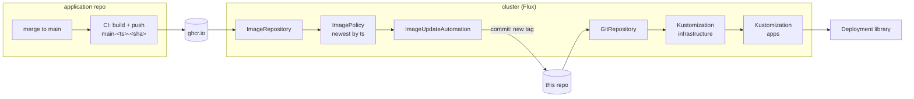
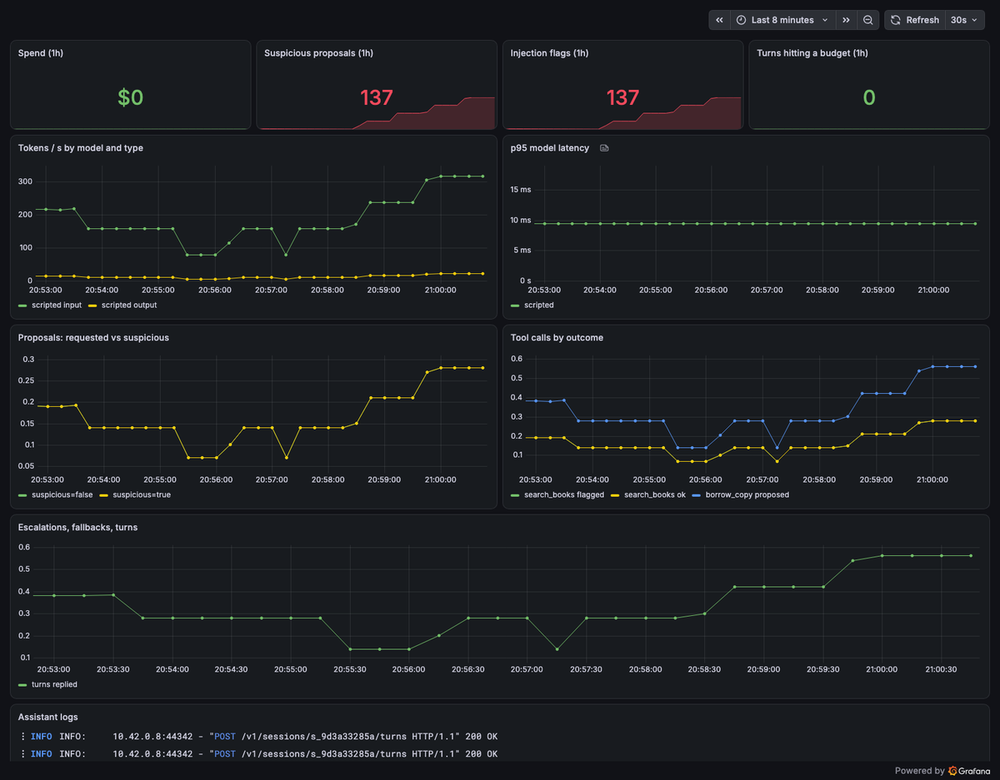
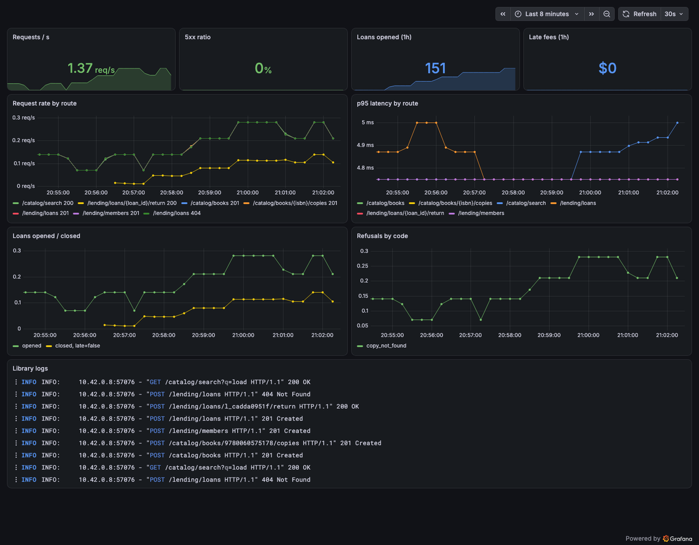

# GitOps reference

[](https://github.com/hasanozkan/gitops-reference/actions/workflows/ci.yml)
 

A small, complete GitOps setup you can run on a laptop in one command: Flux
reconciles a service from Git, in dependency order, onto restricted
workloads — and **a merge to `main` in the application repository becomes a
deploy through a commit here**.

The service is the library API from
[spec-driven-ddd-python](https://github.com/hasanozkan/spec-driven-ddd-python),
published to `ghcr.io/hasanozkan/library-sample` on every merge.



## Run it

Needs Docker, [k3d](https://k3d.io), the [flux](https://fluxcd.io/flux/installation/) CLI and kubectl.

```sh
make up        # k3d cluster + Flux, reconciled from this repo's main branch
make smoke     # borrow a book through the deployed API, check the catalog follows
make status    # flux get all -A
kubectl -n library scale deploy/library --replicas=0   # drift...
flux reconcile kustomization apps                      # ...corrected from Git
make down
```

`make up` deploys and resolves the image policy (`flux get images policy
library` shows the newest tag) but writes nothing back. To see the full
loop, fork this repository and run
`GITOPS_REPO=https://github.com/<you>/gitops-reference GITHUB_TOKEN=<token with contents:write> make up`:
new images now arrive as `chore(image): … -> …` commits in your fork.

## Observability

<p align="center">
  
  
</p>

`make up` also installs a laptop-sized stack — Prometheus, Alertmanager,
Grafana, Loki (logs via Alloy) and Tempo (traces) — and `make traffic` gives
it something to show. `make grafana` opens two dashboards that live in
[`observability/dashboards/`](observability/dashboards) as JSON:

- **Library** — request rate and p95 by route, 5xx ratio, loans opened and
  closed, late fees, refusals by code, and the pods' logs from Loki.
- **Assistant** — tokens and p95 latency by model, spend, suspicious proposals
  and injection flags, tool calls by outcome, escalations, fallbacks, budget
  stops — the metrics from its [telemetry contract](https://github.com/hasanozkan/llm-tool-calling-assistant/blob/main/observability/telemetry.yaml).

Each app declares its `ServiceMonitor` and `PrometheusRule`. CI checks the
whole thing without a cluster ([ADR-0004](docs/adr/0004-observability-as-code.md)):
every series **and label** a panel or alert queries must exist in a service's
telemetry contract (`scripts/check_queries.py` — a dashboard on a renamed
metric fails the build, verified), the assistant's rules must equal its
repository's (`scripts/alerts_mirror.py --check`), and every rule is
unit-tested with `promtool`.

**What running it found.** The first real scrape showed `LibrarySlowRoute`
firing for `/healthz` at a p95 of 4.75 s. The service was fine; the
histogram was not: the SDK's default bucket boundaries are sized for
milliseconds, so every request recorded in seconds landed in the first bucket.
The advised boundaries now live in the telemetry contracts, and the services'
tests compare them — p95 reads ~5 ms. Unit tests could not have caught it;
an alert evaluated on real data did.

## Layout

| Path | What it holds |
|---|---|
| [`clusters/local/sync.yaml`](clusters/local/sync.yaml) | The entry point: Git source → `infrastructure` → `apps` |
| [`clusters/local/image-policy.yaml`](clusters/local/image-policy.yaml) | Registry scan + "newest `main-<ts>-<sha>`" policy |
| [`clusters/local/image-update.yaml`](clusters/local/image-update.yaml) | Write-back: new tags committed to Git |
| [`clusters/local/observability.yaml`](clusters/local/observability.yaml) | The observability stack, as its own Kustomization (local only) |
| [`infrastructure/`](infrastructure) | Namespace with `restricted` Pod Security, default-deny network policy, Helm sources, Prometheus Operator CRDs |
| [`apps/base/`](apps/base) | The library and the assistant: hardened Deployments (with `$imagepolicy` setters), Services, ServiceMonitors, PrometheusRules |
| [`observability/`](observability) | kube-prometheus-stack, Loki, Tempo, Alloy (HelmReleases), dashboards as JSON, alert tests |
| [`apps/local/`](apps/local), [`apps/production/`](apps/production) | Overlays: local ingress · production replicas, spread and disruption budget |

## What CI proves

| Job | Proves |
|---|---|
| `validate` | Every overlay and the cluster entry point render, and pass strict schema validation (Kubernetes, Flux and Prometheus Operator CRDs) |
| `observability` | Dashboards and alerts query only contract series and labels; the assistant's alert mirror is current; every rule passes its promtool tests |
| `e2e` | On a fresh kind cluster, Flux reconciles **this commit**; `infrastructure` then `apps` become Ready; the service passes the smoke test through its Service; the image policy resolves a tag from the registry |

## Decisions

- [ADR-0001 — A merge to main is a deploy, and the deploy is a commit](docs/adr/0001-merge-is-deploy.md)
- [ADR-0002 — Platform before apps, and Ready means serving](docs/adr/0002-ordered-reconciliation.md)
- [ADR-0003 — Workloads are restricted by default](docs/adr/0003-secure-by-default-workloads.md)

## Deliberate simplifications

One cluster, one app, no database. In a production setup the same shape
grows: secrets encrypted in Git (SOPS + age) or pulled from a secret store,
a migration Job gated before each rollout, alerting on failed reconciliations,
and more environments as more `clusters/<name>` entry points over the same
`apps/` overlays.

---

Part of a set: [spec-driven-ddd-python](https://github.com/hasanozkan/spec-driven-ddd-python)
· [llm-tool-calling-assistant](https://github.com/hasanozkan/llm-tool-calling-assistant)
· [ai-native-engineering](https://github.com/hasanozkan/ai-native-engineering).
By [Hasan Özkan](https://github.com/hasanozkan) · [LinkedIn](https://www.linkedin.com/in/hasanozkan/)
